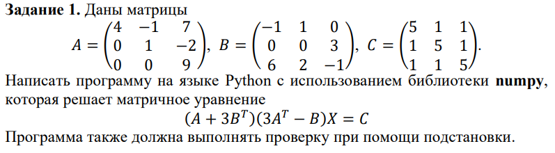
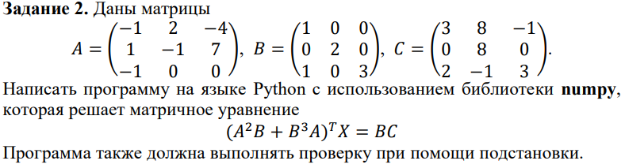
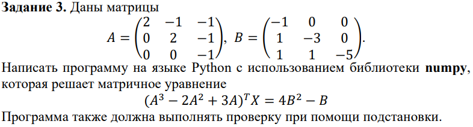

<h2 style="text-align: center;">Бюджетное учреждение высшего образования Ханты-Мансийского автономного округа – Югры</h2>

<h1 style="text-align: center;">«СУРГУТСКИЙ ГОСУДАРСТВЕННЫЙ УНИВЕРСИТЕТ»</h1>

<h2 style="text-align: center;">Политехнический институт</h2>

<p style="text-align: center;">Кафедра прикладной математики</p>

<p style="text-align: center;">Курдюмова Виолетта Евгеньевна</p>

<p style="text-align: center;">Дисциплина «Алгебра и геометрия»</p>

<p style="text-align: center;">направление 01.03.02 «Прикладная математика и информатика»</p>

<p style="text-align: center;">направленность (профиль): «Технологии программирования и анализ данных»</p>

<pre>

</pre>

<p style="text-align: right;">Преподаватель: Шапошникова Ирина Вадимовна  </p>

<p style="text-align: right;">Студент гр. № 601-31</p>

<p style="text-align: right;">Курдюмова Виолетта Евгеньевна</p>

<pre>


</pre>

<p style="text-align: center;">Сургут 2023 г.</p>


<h3 style="text-align: center;">Линейная алгебра. Индивидуальное задание
№1.</h3>




#### Програмное решение 1

```python
import numpy as np
from numpy.linalg import det

A = np.array([[4, -1, 7], 
              [0, 1, -2],
              [0, 0, 9]])

B = np.array([[-1, 1, 0],
              [0, 0, 3],
              [6, 2, -1]])

C = np.array([[5, 1, 1],
              [1, 5, 1],
              [1, 1, 5]])

A_plus_3B_T = A + 3*B.T 
A3_T_minus_B = 3*A.T - B

X = np.linalg.solve(A_plus_3B_T @ (3*A.T - B), C)


# Проверка 
left = (A + 3*B.T) @ (3*A.T - B) @ X
right = C

print(X)
print(np.allclose(left, right)) # True, если решение верное
```


<p style="text-align: center;">Рис. 1. Вывод программы в терминале.</p>




#### Програмное решение 2
```python
import numpy as np

A = np.array([[-1, 2, -4],  
              [1, -1, 7],
              [-1, 0, 0]])

B = np.array([[1, 0, 0],
              [0, 2, 0],
              [1, 0, 3]])

C = np.array([[3, 8, -1],
              [0, 8, 0],
              [2, -1, 3]])

A2 = A**2 
B3 = B**3
left_matrix = ((A2 @ B) + (B3 @ A)).T 

X = np.linalg.solve(left_matrix, B @ C)
print(X)

# Проверка
right = B @ C
check = left_matrix @ X
print(np.allclose(right, check)) 

```


<p style="text-align: center;">Рис. 2. Вывод программы в терминале.</p>





#### Програмное решение 3
```PYTHON
import numpy as np

A = np.array([[2, -1, -1],
              [0, 2, -1],  
              [0, 0, -1]])

B = np.array([[-1, 0, 0],
              [1, -3, 0],
              [1, 1, -5]])

A3 = A**3
A2 = A**2

left_matrix = ((A3 - 2*A2 + 3*A)).T
right_vector = 4*(B**2) - B

X = np.linalg.solve(left_matrix, right_vector)
print(X)

# Проверка 
check = left_matrix @ X
print(np.allclose(right_vector, check))
```


<p style="text-align: center;">Рис. 3. Вывод программы в терминале.</p>

