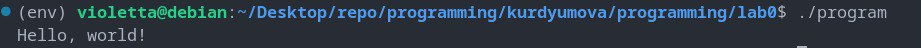

### статическая библиотека

Скомпилируйте файл hello.c в объектный файл с расширением .o:
```
gcc -c hello.c
```
Это создаст файл hello.o.

Создайте статическую библиотеку из объектного файла с помощью утилиты ar (архиватор):
```
ar rcs libhello.a hello.o
```
Эта команда создаст статическую библиотеку libhello.a, содержащую объектный файл hello.o.

Флаги, используемые с ar:

r - заменяет или добавляет новые файлы в архив
c - создает новый архив, если он не существует
s - записывает индексный файл для архива


После этого вы можете использовать созданную библиотеку libhello.a при компиляции других программ, ссылаясь на нее с помощью флага -l:
```
gcc main.c -L. -lhello
```

Шаги для запуска программы:

Скомпилируйте hello.c вместе со статической библиотекой libhello.a:

```
gcc hello.c -L. -lhello -o program
```
Здесь:

-L. указывает компилятору искать библиотеки в текущем каталоге
-lhello ссылается на библиотеку libhello.a
-o program задает имя выходного исполняемого файла


Запустите полученный исполняемый файл program:
```
./program
```


### динамическая библиотека

Создайте файл с объектным кодом из исходного файла hello.c, используя флаг -fPIC (Position Independent Code) для компилятора GCC:
```
gcc -c -fPIC hello.c
```

Это создаст файл hello.o с объектным кодом.

Создайте динамическую библиотеку из объектного файла hello.o, используя команду gcc с флагом -shared:
```
gcc -shared -o libhello.so hello.o
```

Эта команда создаст динамическую библиотеку libhello.so.


Скомпилируйте программу hello.c с использованием динамической библиотеки libhello.so:
```
gcc -o main hello.c -L. -lhello
```
Флаг -L. указывает компилятору искать библиотеки в текущем каталоге, а -lhello указывает на библиотеку libhello.so.

После этого вы можете запустить программу hello, и она будет использовать функцию main() из динамической библиотеки libhello.so.


Скомпилируйте hello.c в исполняемый файл, связав его с библиотекой libhello.so:
```
gcc -o main hello.c -ldl
```
Запустите исполняемый файл main:

```
./main
```
