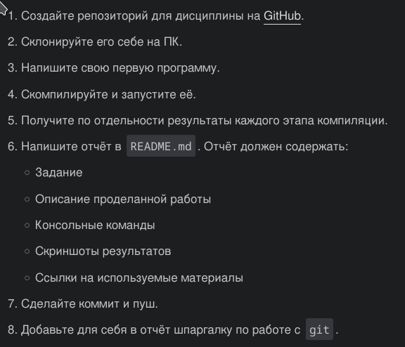
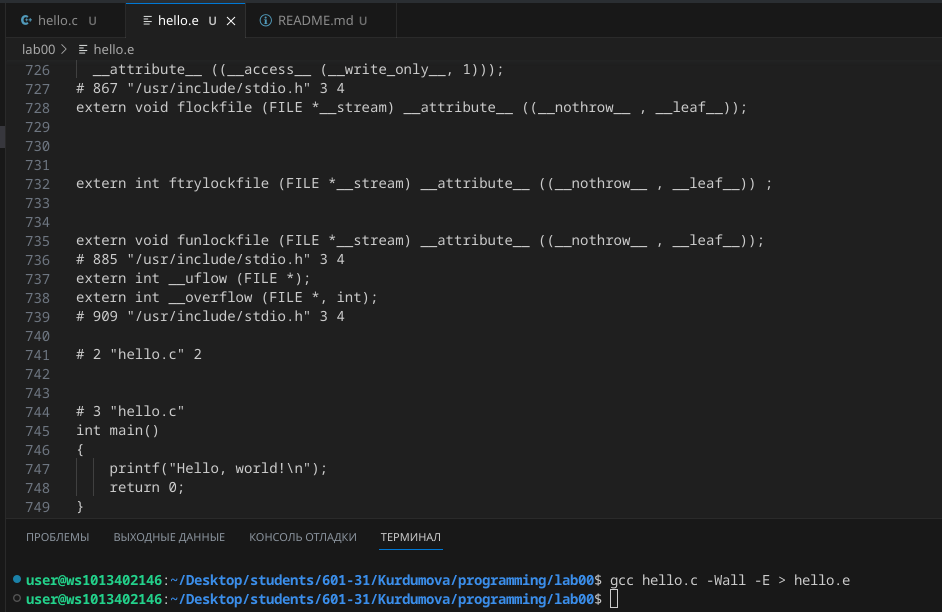
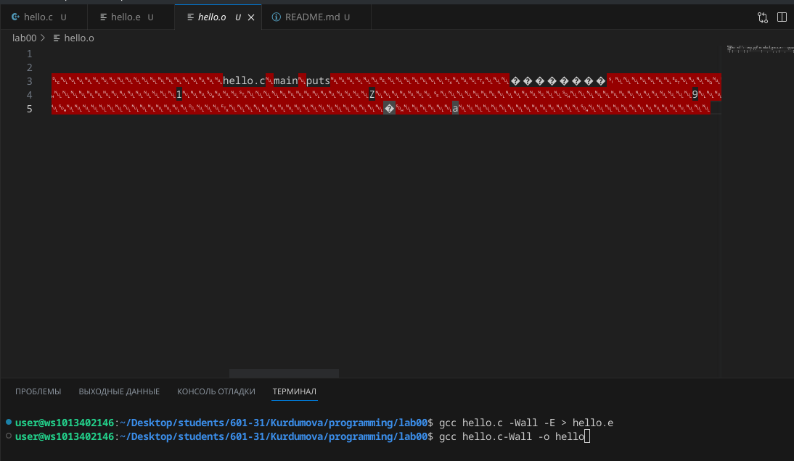
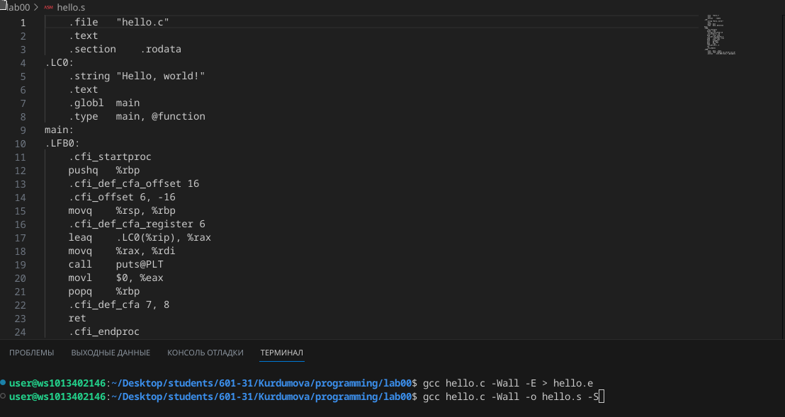

# Лабораторная работа №0
## Задание 



## 1.

https://github.com/violetta0711/programming

### 2. Ход работы
```shell
git clone https://github.com/violetta0711/programming.git
```
### 3. Напишите свою первую программу

```c
#include <stdio.h>

int main()
{
    printf("Hello, world!\n");
    return 0;
}
```
## Консольные команды
### 4. код на C


### 5. процессор


### 6. Компилятор


### 7. Объектные файлы



## Список использованных источников:
https://github.com/still-coding/report_demo/blob/main/README.md?plain=1
https://doka.guide/tools/markdown/