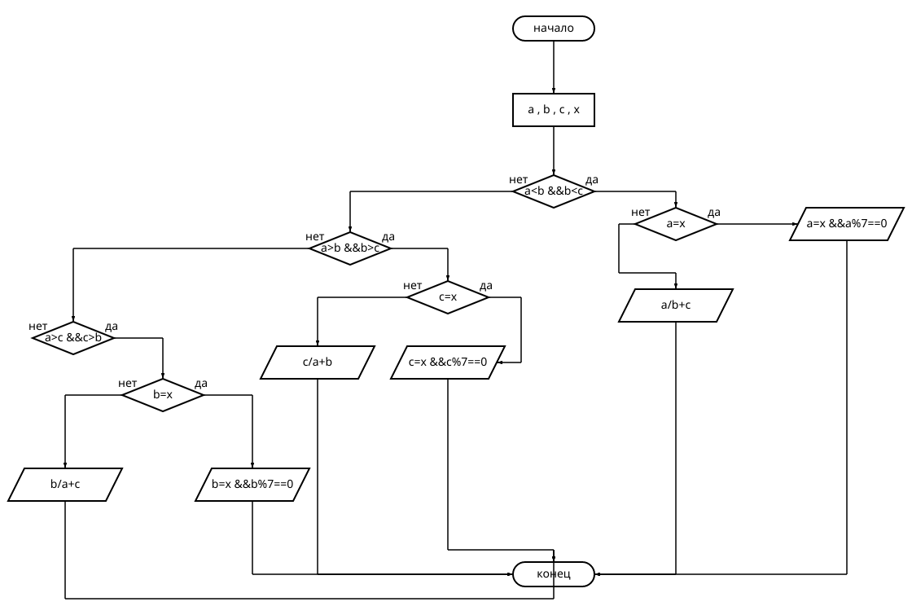
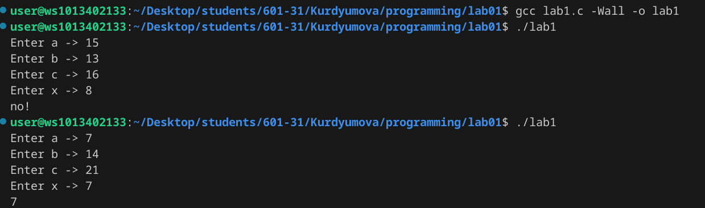

# Лабораторная работа №1
## Задание 
```
    1. Разберите код программы из примера.
    2. Составьте блок-схему алгоритма для своего варианта.
    3. Напишите программу, решающую задачу по своему варианту.
    4. Оформите отчёт в README.md. 
```

### 1. Разберите код программы из примера. 
```
Вывести значение наименьшего из трёх параметров a, b, c если оно меньше или равно x и кратно 7, и частное наименьшего параметра и суммы двух оставшихся иначе.
```
### 2. Составьте блок-схему алгоритма для своего примера.


### 3. 

