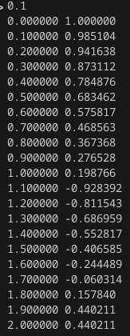
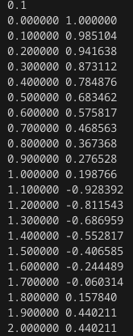
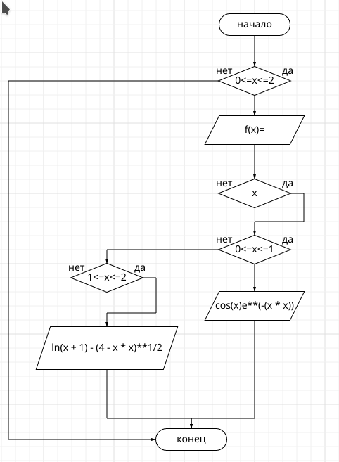

# Лабораторная работа №2
## Задание 
```
1.Напишите программу по варианту, используя оператор цикла while (нечётные варианты) или do while (чётные варианты).
2.Напишите программу, используя оператор цикла for.
3.Постройте график с использованием gnuplot.
4.Составьте блок-схемы.
```

### 1. Напишите программу по варианту, используя оператор цикла while (нечётные варианты) или do while (чётные варианты).

$ f(x) = 
  \begin{cases}
    {cos(x)e^{-x^2}},     & \ 0\leq x \leq 1\\
    {ln(x+1) - \sqrt{(4 - x^2)}},     & \ 1\leq x \leq 2\  \end{cases}
$

```c
#include <stdio.h>
#include <math.h>


int main()
{   
    
    double x, y, h;
    
    
    x = 0.0;
 
    scanf("%lf", &h);
    int n;
    n = 2 / h + 1;

    while (n)
   
    {
        if (x >= 0 && x <= 1)
        
            y = cos(x) * exp(-(x * x));
             
        if (x > 1 && x <= 2)
        
            y = log(x + 1) - sqrt(4 - x * x);
        
        printf("%f %f\n", x, y);
        x += h;
        n = n - 1;
        
    }
    
}
```



### 2.Напишите программу, используя оператор цикла for.
```c
#include <stdio.h>
#include <math.h>


int main()
{   
    
    double x, y, h;
    x = 0.0;
    scanf("%lf", &h);
    int n, i;
    n = 2 / h ;

    for(i =0; i <= n; i++)
    {
      if (x >= 0 && x <= 1)
          y = cos(x) * exp(-(x * x));
      if (x>1 && x <= 2)
          y = log(x + 1) - sqrt(4 - x * x);
      printf("%lf %lf\n", x, y);
      x += h;
    
    }
}
```



### 3.Постройте график с использованием gnuplot.


### 4.Составьте блок-схемы.



### Ссылки на используемые материалы.

https://programforyou.ru/block-diagram-redactor