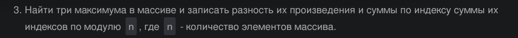

# Лабораторная работа №1
## Задание 
```
    1.Напишите программу по своему варианту.
    2.Оформите отчёт в README.md. Отчёт должен содержать:
        - Задание
        - Описание проделанной работы
        - Скриншоты результатов
        - Ссылки на используемые материалы
```
## Вариант №3: задание



## Скриншот результата
