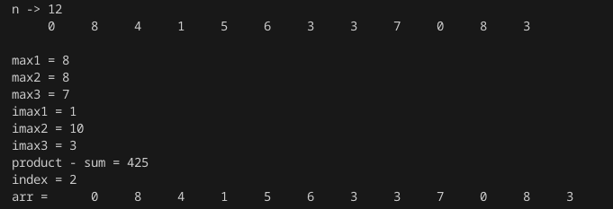

# Лабораторная работа №3
## Задание 

1.Напишите программу по своему варианту.

2.Оформите отчёт в README.md. Отчёт должен содержать:
- Задание
- Описание проделанной работы
- Скриншоты результатов
- Ссылки на используемые материалы

## Вариант №3: задание

Найти три максимума в массиве и записать разность их произведения и суммы по индексу суммы их индексов по модулю `n`, где `n` - количество элементов массива.

## Скриншот результата
