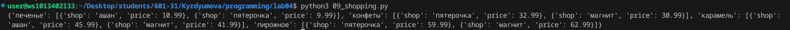

# Лабораторная работа №4
## Задание 
```
1. Скачайте архив и распакуйте его в свой репозиторий. В нём 11 заданий, которые вам нужно выполнить.
2. Оформите отчёт в `README.md`. По каждому из заданий - описание задачи, скриншот работы программы.
```

### 2. Оформите отчёт в `README.md`. По каждому из заданий - описание задачи, скриншот работы программы.


### 00_distance


### 01_circle


### 02_operations


### 03_favorite_movies


### 04_my_family


### 05_zoo


### 06_songs_list


### 07_secret


### 08_garden


### 09_shopping



### 10_store


