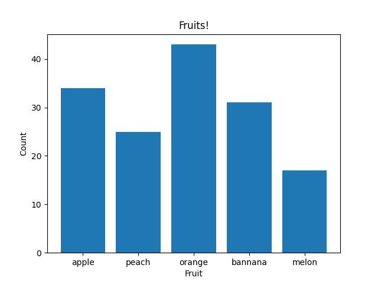
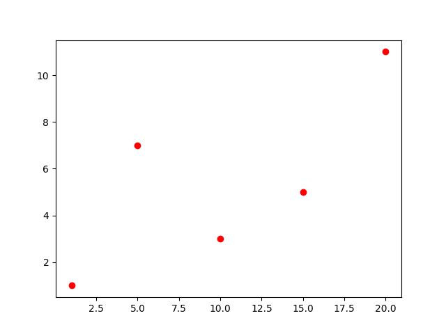

# Лабораторная работа №5
## Задание 

1. Создайте в каталоге для данной ЛР в своём репозитории виртуальное окружение и установите в него matplotlib и numpy. Создайте файл requirements.txt.
2. Откройте книгу [1] и выполните уроки 1-3. Первый урок можно начинать со стр. 8.
3. Выберите одну из неразрывных функции своего варианта из лабораторной работы №2, постройте график этой функции и касательную к ней. Добавьте на график заголовок, подписи осей, легенду, сетку, а также аннотацию к точке касания.
4. Добавьте в корень своего репозитория файл .gitignore отсюда, перед тем как делать очередной коммит.
5. Оформите отчёт в README.md. Отчёт должен содержать:

- графики, построенные во время выполнения уроков из книги
- объяснения процесса решения и график по заданию 4

6. Склонируйте этот репозиторий НЕ в ваш репозиторий, а рядом. Изучите использование этого инструмента и создайте pdf-версию своего отчёта из README.md. Добавьте её в репозиторий.

### 2. Откройте книгу [1] и выполните уроки 1-3. Первый урок можно начинать со стр. 8.

#### <код в файле pra.py>

# 1

# 2

# 3

# 4

# 5
 
# 6
 
# 7

# 8

# 9
 
# 10
 
# 11
 
# 12
 
# 13
 
# 14
 
# 15

# 16
 
# 17
 
# 18
 
# 19
 
# 20
 
# 21
 
# 22

# 23

# 24
 
# 25

# 26
 
# 27
 
# 28
 
# 29
 
# 30
 
# 31

# 32
 
# 33
 
# 34
 
# 35
 
# 36
 
# 37
 
# 38
 
# 39

### 3. Выберите одну из неразрывных функции своего варианта из лабораторной работы №2, постройте график этой функции и касательную к ней. Добавьте на график заголовок, подписи осей, легенду, сетку, а также аннотацию к точке касания.
 
#### Вариант 3.
$$ f(x) = 
  \begin{cases}
    {cos(x)e^{-x^2}},     & \ 0\leq x \leq 1\\
    {ln(x+1) - \sqrt{(4 - x^2)}},     & \ 1\leq x \leq 2\  \end{cases}
$$

#### <код в файле lab5.py>

