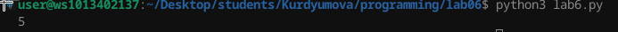
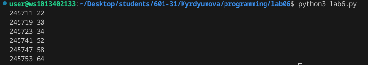

# Лабораторная работа №6
## Задание 

1.   Напишите программу для решения задач своего варианта.
2.   Оформите отчёт в README.md. Отчёт должен содержать:
- Условия задач
- Описание проделанной работы
- Скриншоты результатов
- Ссылки на используемые материалы

## Условия задач:

- Андрей составляет 6-буквенные коды из букв А, Н, Д, Р, Е, Й. Буква Й может использоваться в коде не более одного раза, при этом она не может стоять на первом месте, на последнем месте и рядом с буквой Е. Все остальные буквы могут встречаться произвольное количество раз или не встречаться совсем. Сколько различных кодов может составить Андрей?

```py
import itertools
alp = "АНДРЕЙ"
ar = itertools.product(alp, repeat=6) 
arl = []
for i in ar:
    arl.append(''.join(i))

count = 0
for e in arl:
    e[0] == 'Й'
    e[-1] == 'Й'
    if e.count('Й') > 1:
        continue
    if  e.startswith('Й'):
        continue
    if  e.endswith('Й'):
        continue
    flag = True
    for i in range(len(e)-1):
        if (e[i] == 'Й' and e[i + 1] == 'Е') or (e[i + 1] == 'Й' and e[i] == 'Е'):
           flag = False
           break
    if flag == True: count += 1
print(count)

```
### Скриншот результата:


- Сколько единиц содержится в двоичной записи значения выражения $8^{2020}+4^{2017}+26−1$?

```py
n = 8**2020 + 4**2017 + 26 - 1
s = bin(n)[2:]
print(s.count('1'))
```
### Скриншот результата:



- Найдите среди целых чисел, принадлежащих числовому отрезку [245 690; 245 756] [245 690; 245 756] [245 690; 245 756] простые числа. Выведите на экран все найденные простые числа в порядке возрастания, слева от каждого числа выведите его порядковый номер в последовательности. Каждая пара чисел должна быть выведена в отдельной строке.

```py
def f(n):
    for d in range (2, int(n**0.5) + 1):
        if n%d == 0:
            return False
    return True

m = 0
for n in range(245690 , 245756 + 1):  
    m += 1
    if f(n) == True:
        print(m, n)
    
```
### Скриншот результата:



### Ссылки на используемые материалы:
https://evil-teacher.on.fleek.co/prog_pm/lab06/

https://habr.com/ru/companies/otus/articles/529356/