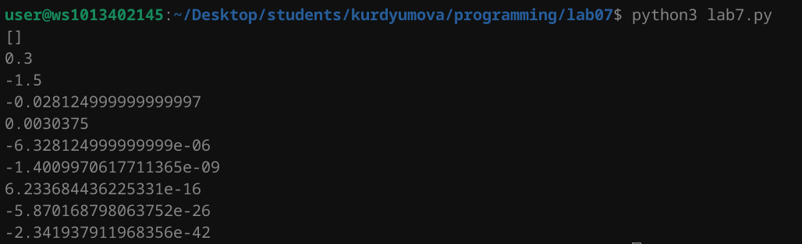

# Лабораторная работа №7
## Задание 

1. Напишите две функции для решения задач своего варианта - с использованием рекурсии и без.
2. Оформите отчёт в README.md. Отчёт должен содержать:
- Условия задач
- Описание проделанной работы
- Скриншоты результатов
- Ссылки на используемые материалы

1. Условия задач:
 Функция для распаковки списка, содержащего другие объекты (`int`, `str`, `list`, `tuple`, `dict`, `set`) произвольной вложенности.

```python
>>> unpack([None, [1, ({2, 3}, {'foo': 'bar'})]])
[None, 1, 2, 3, 'foo', 'bar']
```
- Функция для расчёта 
$$ w_i = w_{i-1}w_{i-2}\frac{(i-1)^2}{(i+1)^3}. w_1 = 0.3, w_2 = -1.5.$$


