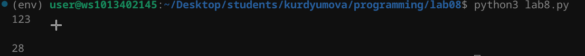

# Лабораторная работа №8
## Задание 

1. Решите обе задачи своего варианта.
2. Примените декоратор к замыканию.
3. Оформите отчёт в README.md. Отчёт должен содержать:
- Условия задач
- Описание проделанной работы
- Скриншоты результатов
- Ссылки на используемые материалы

### Условия задач:
- Замыкание для получения очередной строки из файла.
- Декоратор, который будет логировать вызовы функций.

### Скриншоты результатов:

