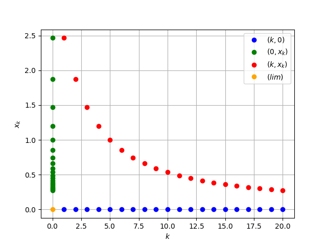
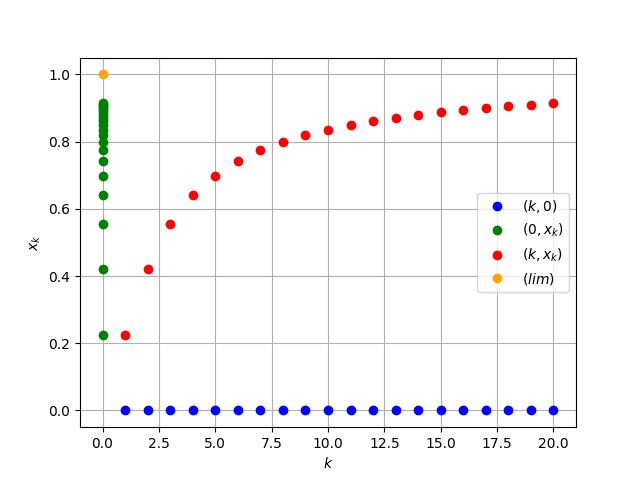

<h2 style="text-align: center;">Бюджетное учреждение высшего образования Ханты-Мансийского автономного округа – Югры</h2>

<h1 style="text-align: center;">«СУРГУТСКИЙ ГОСУДАРСТВЕННЫЙ УНИВЕРСИТЕТ»</h1>

<h2 style="text-align: center;">Политехнический институт</h2>

<p style="text-align: center;">Кафедра прикладной математики</p>

<p style="text-align: center;">Курдюмова Виолетта Евгеньевна</p>

<h1 style="text-align: center;">Числовые последовательности</h1>

<p style="text-align: center;">Дисциплина «Математический анализ»</p>

<p style="text-align: center;">направление 01.03.02 «Прикладная математика и информатика»</p>

<p style="text-align: center;">направленность (профиль): «Технологии программирования и анализ данных»</p>

<pre>

</pre>

<p style="text-align: right;">Преподаватель: Ряховский Алексей Васильевич  </p>

<p style="text-align: right;">Доцент</p>

<p style="text-align: right;">Студент гр. № 601-31</p>

<p style="text-align: right;">Курдюмова Виолетта Евгеньевна</p>

<pre>

</pre>

<p style="text-align: center;">Сургут 2023 г.</p>

<h3 style="text-align: center;">Лабораторная работа №1. Числовые последовательности.</h3>
<h3 style="text-align: center;">Вариант №12</h3>


#### Задание

Вычислить пределы данных числовых последовательностей двумя способами:

- аналитически
- используя библиотеки Python для символьных вычислений.

Для каждой числовой последовательности $\{x_k\}_{k=1}^\infty$ на одном рисунке построить (используя графические пакеты Python) следующие множества точек ($k = 1, \ldots, m$):

- (k, 0) – синий цвет
- (0, $x_k$) – зеленый цвет
- (k, $x_k$) – красный цвет

В случае, если последовательность сходится, построить на соответствующем рисунке точку (оранжевый цвет) изображающую предел последовательности $\{x_k\}_{k=1}^\infty$.

В задача 1 для сходящихся последовательностей, для заданного $\varepsilon>0$ найти такой номер $n(\varepsilon)$, начиная с которого $|x_k-A|<\varepsilon, \forall k\geq n(\varepsilon)$

#### Аналитическое решение 1

Рассмотрим предел:

$\lim\limits_{n\rightarrow\infty}{\sqrt {n^2 + 11} - n}$

Вычислич предел каждого слагаемого отдельно:

- $\lim\limits_{n\rightarrow\infty}{\sqrt {n^2 + 11}} =\infty$
- $\lim\limits_{n\rightarrow\infty}{n} = \infty$

Поскольку выражение $\infty-\infty$ является неопределенностью, преобразуем его,  умножим выражение на $ \frac{\sqrt {n^2 + 11} + n}{ \sqrt {n + 11} + n}$ :

$\lim\limits_{n\rightarrow\infty}{\frac{(\sqrt {n^2 + 11} - n)(\sqrt {n^2 + 11} + n)}{{\sqrt {n^2 + 11} + n}}}$

$\lim\limits_{n\rightarrow\infty}{\frac{n^2 + 11 - n^2}{{\sqrt {n^2 + 11} + n}}}$

$\lim\limits_{n\rightarrow\infty}{\frac{\frac {11n}{n}}{{\sqrt {n^2 + 11} + n}}}$

$\lim\limits_{n\rightarrow\infty}{\frac{n \frac {11}{n}}{n\sqrt {1 + {\frac{11}{n^2} + n}}}}$

$\lim\limits_{n\rightarrow\infty}{\frac{\frac {11}{n}}{\sqrt {1 + {\frac{11}{n^2} + 1}}}}$


Следовательно:

$\lim\limits_{n\rightarrow\infty}{\frac{ {11}*{0}}{\sqrt {1 + {{11}*{0} + 1}}}} = 0$

Найдем предел:
$\lim\limits_{n\rightarrow\infty}{0} = 0$

Найдем номер n(ε):

$\lim\limits_{n\rightarrow\infty}{\sqrt {n^2 + 11} - n} = 0$


#### Программное решение 1

```python
#!/usr/bin/env python
import matplotlib.pyplot as plt
import numpy as np
import math
from sympy import *
n = Symbol("n")
def sequence(n):
    return (((n**2 + 11)**0.5) - n)
def plot_points(m):
    x = np.arange(1, m + 1)
    y = sequence(x)
    # (k, 0) - blue colour
    plt.plot(x, np.zeros_like(x), 'bo', label='$(k, 0)$')
    # (0, x_k) - green color
    plt.plot(np.zeros_like(x), y, 'go', label='$(0, x_k)$')
    # (k, x_k) - red color
    plt.plot(x, y, 'ro', label='$(k, x_k)$')
    lim_value = limit((((n**2 + 11)**0.5) - n), n, oo)
    plt.plot(0, lim_value, 'o', color='orange', label='$(lim)$') # Точка предела
    plt.xlabel('$k$')
    plt.ylabel('$x_k$')
    plt.legend()
    plt.grid()
    plt.show()

m = 20 # number of points
plot_points(m)
a = limit((((n**2 + 11)**0.5) - n), n, oo)
limit_value = sequence(m) # Вычисляем предел последовательности
plt.plot(m, limit_value, 'o', color='orange') # Строим точку предела последовательности
plt.axhline(y=limit_value, linestyle='--', color='orange')
print(a)

```


<p style="text-align: center;">Рис. 1. Иллюстрация решения задачи.</p>




<p style="text-align: center;">Рис. 2. Вывод программы в терминале.</p>


#### Аналитическое решение 2


#### Программное решение 2

```python
#!/usr/bin/env python
import matplotlib.pyplot as plt
import numpy as np
import math
from sympy import *
n = Symbol("n")
def sequence(n):
    return ((5*n**4 + n**3 + 1)/((n + 1)**5) - n**5)
def plot_points(m):
    x = np.arange(1, m + 1)
    y = sequence(x)
    # (k, 0) - blue colour
    plt.plot(x, np.zeros_like(x), 'bo', label='$(k, 0)$')
    # (0, x_k) - green color
    plt.plot(np.zeros_like(x), y, 'go', label='$(0, x_k)$')
    # (k, x_k) - red color
    plt.plot(x, y, 'ro', label='$(k, x_k)$')
    lim_value = limit(((5*n**4 + n**3 + 1)/((n + 5)**5) - n**5), n, oo)
    plt.plot(0, lim_value, 'o', color='orange', label='$(lim)$') # Точка предела
    plt.xlabel('$k$')
    plt.ylabel('$x_k$')
    plt.legend()
    plt.grid()
    plt.show()

m = 20 # number of points
plot_points(m)
a = limit(((5*n**4 + n**3 + 1)/((n + 5)**5) - n**5), n, oo)
limit_value = sequence(m) # Вычисляем предел последовательности
plt.plot(m, limit_value, 'o', color='orange') # Строим точку предела последовательности
plt.axhline(y=limit_value, linestyle='--', color='orange')
print(a)
```


<p style="text-align: center;">Рис. 1. Иллюстрация решения задачи.</p>




<p style="text-align: center;">Рис. 2. Вывод программы в терминале.</p>

.png>)


#### Аналитическое решение 3

#### Программное решение 3

```python


```