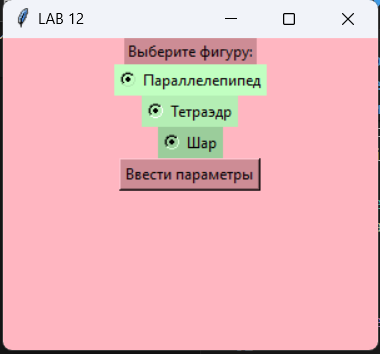

# Лабораторная работа №12
## Задание 

1. По своему варианту задания и GUI фреймворка создайте пакет, содержащий 3 модуля, и подключите его к основной программе. Основная программа должна предоставлять:

- графический пользовательский интерфейс с возможностями ввода требуемых параметров и отображения результатов расчёта,
- возможность сохранить результаты в отчёт формата .doc или .xls (например, пакеты python-docx и openpyxl).


### иснструкция по запуску:
Для начала установите пакеты python-docx и openpyxl:


```
pip install python-docx
```

```
pip install openpyxl
```

### Модули находятся в файлах parallelepiped.py, tetrahedron.py, sphere.py:

```python
import tkinter as tk
import  math

class Parallelepiped:
    def calculate_parallelepiped(root, a, b, c, density):
        V = a * b * c
        S = 2 * (a*b + b*c + a*c)
        m = V * density
        return V, S, m
```

```python
import math
import tkinter as tk

class Tetrahedron:
    def calculate_tetrahedron(root, a, density):
        V = (a**3) / (6 * math.sqrt(2)) 
        S = math.sqrt(3) * (a**2)
        m = V * density
        return V, S, m
```

```python
import math
import tkinter as tk

class Sphere:
    def calculate_sphere(root, R, density):
        V = (4/3) * math.pi * (R**3)
        S = 4 * math.pi * (R**2) 
        m = V * density
        return V, S, m
```

### Сам код программы для задания находится в файле lab12.py. 

### После запуска программы в окне появится графический интерфейс.


#### Параллелепипед:


#### Тетраэдр:


#### Шар:


#### Окно результатов:


#### Затем после выбора и ввода данных полученный результат сохранится в файлы result.docx и result.xlsx.
 
 

