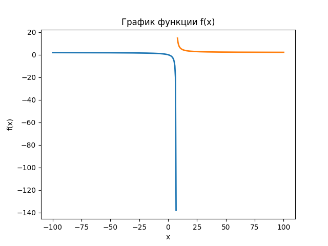
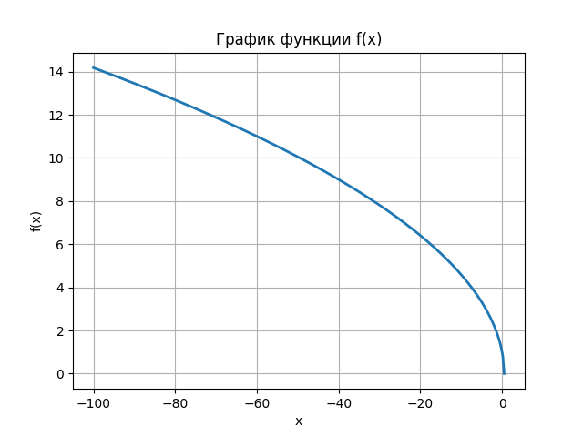
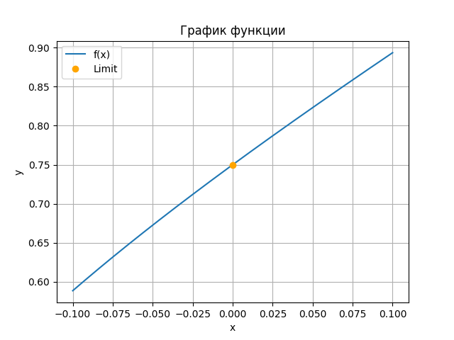
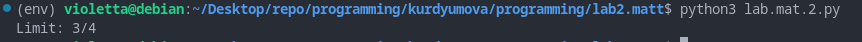
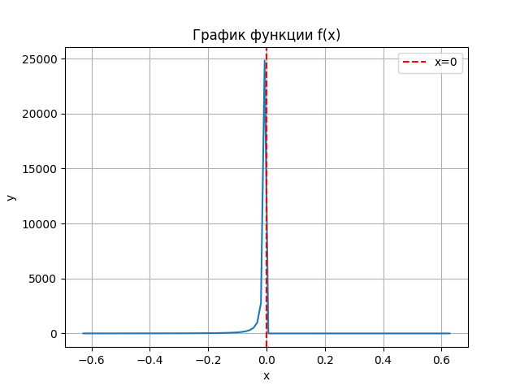
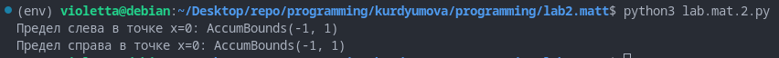

<h2 style="text-align: center;">Бюджетное учреждение высшего образования Ханты-Мансийского автономного округа – Югры</h2>

<h1 style="text-align: center;">«СУРГУТСКИЙ ГОСУДАРСТВЕННЫЙ УНИВЕРСИТЕТ»</h1>

<h2 style="text-align: center;">Политехнический институт</h2>

<p style="text-align: center;">Кафедра прикладной математики</p>

<p style="text-align: center;">Курдюмова Виолетта Евгеньевна</p>

<h1 style="text-align: center;">Функции одной переменной. Предел и непрерывность функции.</h1>

<p style="text-align: center;">Дисциплина «Математический анализ»</p>

<p style="text-align: center;">направление 01.03.02 «Прикладная математика и информатика»</p>

<p style="text-align: center;">направленность (профиль): «Технологии программирования и анализ данных»</p>

<pre>

</pre>

<p style="text-align: right;">Преподаватель: Ряховский Алексей Васильевич  </p>

<p style="text-align: right;">Доцент</p>

<p style="text-align: right;">Студент гр. № 601-31</p>

<p style="text-align: right;">Курдюмова Виолетта Евгеньевна</p>

<pre>

</pre>

<p style="text-align: center;">Сургут 2023 г.</p>

<h3 style="text-align: center;">Лабораторная работа №2. Функции одной переменной. Предел и непрерывность функции.</h3>
<h3 style="text-align: center;">Вариант №12</h3>


#### Задание


2.1. Аналитически найти область определения функций, а затем построить их
графики, используя графические пакеты Python. Для каждой из функций
график построить на отдельном рисунке.

2.2. Вычислить пределы данных функций двумя способами: аналитически и
используя библиотеки Python для символьных вычислений. Используя
графические пакеты Python, построить графики функций, иллюстрирующие
поведение функций в окрестностях тех точек, в которых вычисляется предел.
Если предел существует, построить на соответствующем рисунке точку,
изображающую предел данной функции.

2.3. Найти (аналитически и используя библиотеки Python для символьных
вычислений) точки разрыва функции и определить их тип. Используя
графические пакеты Python построить графики функций, иллюстрирующие
поведение функций в окрестностях точек разрыва.


#### Аналитическое решение 2.1.1

$ f(x) = \frac{2x}{x - 7 } $

Найдем область определения:

$ x - 7 \neq 0 $

$ x \neq -7 $

Область определения:

$ D(f) = (-\infty; 7)\cup (7; +\infty) $


Ответ: $ D(f) = (-\infty; 7)\cup (7; +\infty) $

#### Программное решение 2.1.1
```python
import matplotlib.pyplot as plt
import numpy as np
import math
from sympy import *

# Определение функции
def f(x):
    return (2*x)/(x - 7)
# Создание массива значений x
x = np.linspace(-100, 6.9, 200)
# Вычисление значений y для каждого значения x
y = []
for i in x:
    y.append(f(i))
# Построение графика
plt.plot(x, y, linewidth=2)
plt.xlabel('x')
plt.ylabel('f(x)')
plt.title('График функции f(x)')
plt.grid()
x = np.linspace(7.1, 100, 200)
y = []
for i in x:
    y.append(f(i))
# Построение графика
plt.plot(x, y, linewidth=2)
plt.xlabel('x')
plt.ylabel('f(x)')
plt.title('График функции f(x)')
plt.grid()
plt.show()
```
#### Иллюстрация решения 2.1.1


<p style="text-align: center;">Рис. 2.1.1. График решения задачи.</p>

#### Аналитическое решение 2.1.2

$ g(x) =  \sqrt {1 - 2x}$

Найдем область определения:

$ 1 - 2x \geq 0 $ 

$ 2x \leq 1 $

$ x \leq \frac{1}{2} $

Следовательно:

$ D(g) = (-\infty; \frac{1}{2} ] $

Ответ: $ D(f) = (-\infty; \frac{1}{2} ] $

#### Программное решение 2.1.2
```python
import matplotlib.pyplot as plt
import numpy as np
import math
from sympy import *

# Определение функции
def f(x):
    return sqrt(1 - 2*x)
# Создание массива значений x
x = np.linspace(-100, 1/2, 300)
# Вычисление значений y для каждого значения x
y = []
for i in x:
    y.append(f(i))
# Построение графика
plt.plot(x, y, linewidth=2)
plt.xlabel('x')
plt.ylabel('f(x)')
plt.title('График функции f(x)')
plt.grid()
plt.show()
```
#### Иллюстрация решения 2.1.2

<p style="text-align: center;">Рис. 2.1.2. График решения задачи.</p>


#### Аналитическое решение 2.2

Вычислим предел данной функции:

$ \lim\limits_{x\rightarrow\ 0}{\frac{xarcsinx + sin2x^2}{sinxln(1 + 4x)}} $

Поскольку выражение $\frac{0}{0}$ является неопределенностью, преобразуем его и возведем в степень $\frac{1}{4x}$, а также раздеим выражение на $\frac{1}{4x}$:

$ \lim\limits_{x\rightarrow\ 0}{\frac{xarcsinx + sin2x^2}{4xsinxln(1 + 4x)^\frac{1}{4x}}} $

Используем второй замечательный предел :

$ \lim\limits_{x\rightarrow\infty}{(1 + \frac{1}{x})^x = e}$

$ \lim\limits_{x\rightarrow\ 0}{\frac{xarcsinx + sin2x^2}{4ln(e)xsinx}}= \lim\limits_{x\rightarrow\ 0}{\frac{xarcsinx + sin2x^2}{4xsinx}} $

Группируем и используем первый замечательный предел. Умножим и разделим первое слагаемое в числителе на $2x^2$, второе слагаемое в числителе и знаменатель на $x$:

$ \frac{1}{4}\lim\limits_{x\rightarrow\ 0}{\frac{2x^2\frac{sin2x^2}{2x^2}+x^2\frac{arcsinx}{x}}{x^2\frac{sinx}{x}}} $

$ \frac{1}{4}\lim\limits_{x\rightarrow\ 0}{3} $

Предел от константы:

$ \frac{1}{4}\lim\limits_{x\rightarrow\ 0}{3} = \frac{3}{4}$

Ответ: $\frac{3}{4}$

#### Программное решение 2.2

```python
import matplotlib.pyplot as plt
import numpy as np
import sympy as smp
x = smp.symbols('x')
# Объявляем функцию
def f(x):
    return ((x * smp.asin(x))+(smp.sin(2*x**2)))/(smp.sin(x) * (smp.log(1 + 4*x)))

def plot_points():
    x_values = np.linspace(-0.1, 0.1, 300)
    y_values = [f(n) for n in x_values]
    # Строим график
    plt.plot(x_values, y_values, label='f(x)')
    # Вычисление предела
    lim = smp.limit(f(x), x, 0)
    # Изображаем предел точкой
    plt.plot(0, lim, 'o', color='orange', label='Limit')
    plt.xlabel('x')
    plt.ylabel('y')
    plt.title('График функции')
    plt.legend()
    plt.grid()
    plt.show()
plot_points()
# Определение функции
f = ((x * smp.asin(x))+(smp.sin(2*x**2)))/(smp.sin(x)*smp.log(1 + 4*x))
# Вычисление предела
lim = smp.limit(f, x, 0)
print(f'Limit: {lim}')
```
#### Иллюстрация решения 2.2



<p style="text-align: center;">Рис. 2.2. График решения задачи.</p>


<p style="text-align: center;">Рис. 2.2. Вывод программы в терминале.</p>

#### Аналитическое решение 2.3
$$ f(x) = 
  \begin{cases}
    {\frac{1}{x^2}},     &  x < 0\\
    {cos(x + 1)},     &  x \geq 0\  \end{cases}
$$

Исследуем точку стыка промежутков $x_0 = 0$:

$ x_0 = 0 $

$ \lim\limits_{x\rightarrow\ 0 -0}{\frac{1}{x^2} = \infty } $

$ \lim\limits_{x\rightarrow\ 0 +0}{cos(x + 1)} = cos1 $

В этой точке существует только один односторонний предел, поэтому эта точка разрыва 2-го рода.


Ответ: точка $ x_0 = 0 $ является точкой разрыва 2-го рода.


#### Программное решение 2.3
```python
import matplotlib.pyplot as plt
import numpy as np
from math import *
from sympy import *
# Определение символа x
x = Symbol ('x')
def f(x):
    if x < 0:
        return 1/(x**2)
    else:
        return(np.cos(x+1))
# Создание массива значений x около точки разрыва
x0 = np.linspace(-0.2 * np.pi, 0.2 * np.pi, 100)
y0 = []
for i in x0:
    y0.append(f(i))
# Построение графика
plt.plot(x0, y0)
plt.axvline(x=0, color='red', linestyle='--', label='x=0')
plt.xlabel('x')
plt.ylabel('y')
plt.title('График функции f(x)')
plt.legend()
plt.grid()
plt.show()
f1 = 1/(x**2)
lim_left = limit(f1, x, 0, dir='-')
# по умолчанию вычисляется предел справа
f2 = cos(x+1)
lim_right = limit(f2, x, 0)
print(f'Предел слева в точке x=0: {lim_left}')
print(f'Предел справа в точке x=0: {lim_right}')
```
#### Иллюстрация решения 2.3



<p style="text-align: center;">Рис. 2.3. График решения задачи.</p>



<p style="text-align: center;">Рис. 2.3. Вывод программы в терминале.</p>