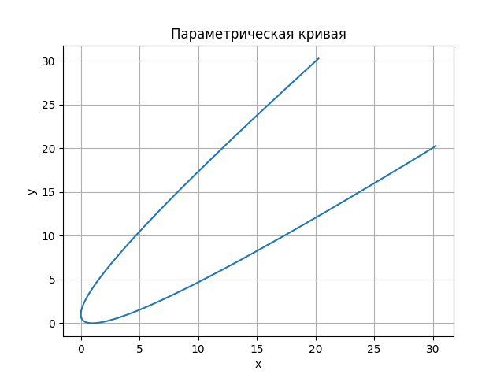
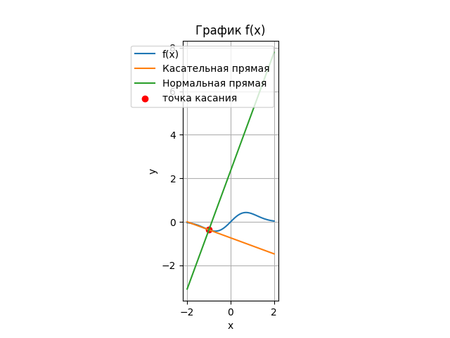

<h2 style="text-align: center;">Бюджетное учреждение высшего образования Ханты-Мансийского автономного округа – Югры</h2>

<h1 style="text-align: center;">«СУРГУТСКИЙ ГОСУДАРСТВЕННЫЙ УНИВЕРСИТЕТ»</h1>

<h2 style="text-align: center;">Политехнический институт</h2>

<p style="text-align: center;">Кафедра прикладной математики</p>

<p style="text-align: center;">Курдюмова Виолетта Евгеньевна</p>

<h1 style="text-align: center;">Параметрически заданные кривые.
Производная, дифференциал.</h1>

<p style="text-align: center;">Дисциплина «Математический анализ»</p>

<p style="text-align: center;">направление 01.03.02 «Прикладная математика и информатика»</p>

<p style="text-align: center;">направленность (профиль): «Технологии программирования и анализ данных»</p>

<pre>

</pre>

<p style="text-align: right;">Преподаватель: Ряховский Алексей Васильевич  </p>

<p style="text-align: right;">Доцент</p>

<p style="text-align: right;">Студент гр. № 601-31</p>

<p style="text-align: right;">Курдюмова Виолетта Евгеньевна</p>

<pre>

</pre>

<p style="text-align: center;">Сургут 2023 г.</p>

<h3 style="text-align: center;">Лабораторная работа №3. Параметрически заданные кривые.
Производная, дифференциал.</h3>
<h3 style="text-align: center;">Вариант №12</h3>


#### Задание

1. Используя графические пакеты Python построить параметрически
заданную кривую.
2. Для заданной функции 𝑓(𝑥) аналитически найти уравнения касательной
прямой и нормальной прямой в указанной точке 𝑥0. Используя графические
пакеты Python построить на одном рисунке график функции 𝑓(𝑥),
касательную прямую, нормальную прямую и отметить точку касания.


#### Задание 1

1. Используя графические пакеты Python построить параметрически
заданную кривую.

$ x = \frac{(t + 1)^2}{4} $

$ y = \frac{(t - 1)^2}{4} $

#### Программное решение 1
```python

import matplotlib.pyplot as plt 
import numpy as np

#создаем массив значения параметра t
t = np.linspace(-10,10,500) #задаем диапозон значений от -10 до 10

# вычисляем x и y  

x = ((t+1)**2)/4
y = ((t-1)**2)/4

#используем объекты figure и axes из matplotlib
fig, ax = plt.subplots()
#строим кривую
ax.plot(x,y)
#заголовок и метки осей
ax.set_title('Параметрическая кривая')
ax.set_xlabel('x')
ax.set_ylabel('y')
ax.grid(True)
plt.show()

```




<p style="text-align: center;">Рис. 1. Параметрически заданая кривая.</p>


#### Задание 2

2. Для заданной функции 𝑓(𝑥) аналитически найти уравнения касательной
прямой и нормальной прямой в указанной точке 𝑥0. Используя графические
пакеты Python построить на одном рисунке график функции 𝑓(𝑥),
касательную прямую, нормальную прямую и отметить точку касания.

$ f(x) = xe^{-x^2} $  
$  x_0 = -1 $

#### Аналитическое решение 2

Сначала найдем производную функции f(x):

$ f'(x) = (xe^{-x^2})' = (x)'e^{-x^2} + x(e^{-x^2})' = e^{-x^2}(1-2x^2) $

Теперь найдем значение производной в точке $x_0 = -1$:

$ f'(-1) = e^{-1}(1 - 2(-1)^2) = - e^{-1}$

Таким образом, уравнение касательной прямой принимает вид:

$ y = f(x_0) + f'(x_0)(x-x_0) = f(-1) + f'(-1)(x - (-1)) = -e^{-1} + (- \frac{1}{e})(x + 1) =  - \frac{1}{e}(2 + x) $

Уравнение нормальной прямой будет перпендикулярным касательной прямой и проходящим через точку касания. Так как находимся в двумерном пространстве, перпендикулярной будет прямая, у которой коэффиценты $ k $ и $ b $ меняются местами и один из них умножается на $ -1 $. Таким образом, уравнение нормальной прямой имеет вид:

$ y = f(x_0) - \frac{1}{f'(x_0)}(x-x_0) = \frac{-1}{f'(-1)}(x - (-1)) + f(-1) = \frac{-1}{-e^{-1}}(x + 1) + (-\frac{1}{e}) = ex + e - \frac{1}{e} $


#### Программное решение 2


```python
import matplotlib.pyplot as plt 
import numpy as np

# определяем f(x)
def f(x):
    return x * np.exp(-x**2)
# определяем уравнение касательной прямой
def tangent_line(x):
    return -np.exp(-1)*(2+x)
# определяем уравнение нормальной прямой
def normal_line(x):
    return np.exp(1) * x + np.exp(1) - np.exp(-1)

x = np.linspace(-2,2,100)
y = f(x)

plt.plot(x,y, label = 'f(x)')
plt.plot(x, tangent_line(x), label = 'Касательная прямая')
plt.plot(x, normal_line(x), label = 'Нормальная прямая')
plt.scatter(-1, f(-1), color = 'r', label = 'точка касания')
plt.legend()
plt.xlabel('x')
plt.ylabel('y')
plt.title('График f(x)')
plt.grid(True)
plt.gca().set_aspect('equal')
plt.show()
```



<p style="text-align: center;">Рис. 2. Иллюстрация решения задачи 2.</p>