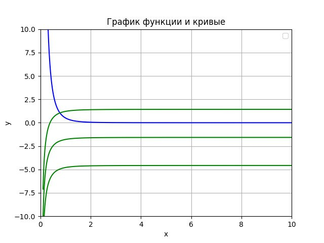
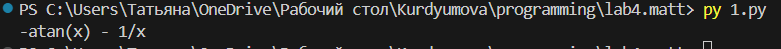
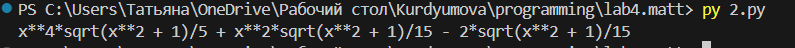
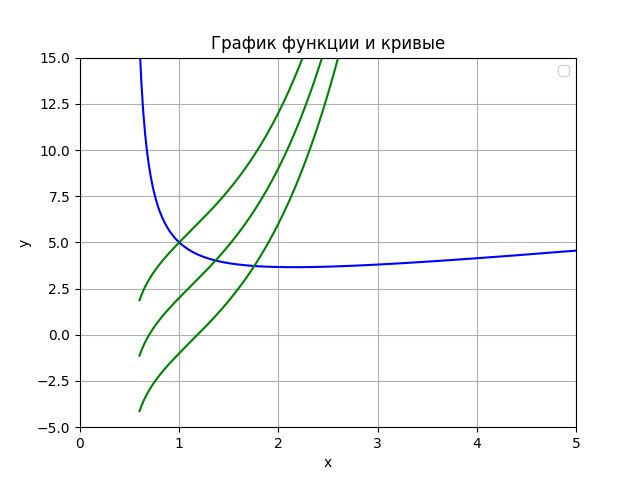
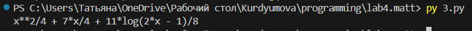

<h2 style="text-align: center;">Бюджетное учреждение высшего образования Ханты-Мансийского автономного округа – Югры</h2>

<h1 style="text-align: center;">«СУРГУТСКИЙ ГОСУДАРСТВЕННЫЙ УНИВЕРСИТЕТ»</h1>

<h2 style="text-align: center;">Политехнический институт</h2>

<p style="text-align: center;">Кафедра прикладной математики</p>

<p style="text-align: center;">Курдюмова Виолетта Евгеньевна</p>

<h1 style="text-align: center;">Неопределенный интеграл.</h1>

<p style="text-align: center;">Дисциплина «Математический анализ»</p>

<p style="text-align: center;">направление 01.03.02 «Прикладная математика и информатика»</p>

<p style="text-align: center;">направленность (профиль): «Технологии программирования и анализ данных»</p>

<pre>

</pre>

<p style="text-align: right;">Преподаватель: Ряховский Алексей Васильевич  </p>

<p style="text-align: right;">Доцент</p>

<p style="text-align: right;">Студент гр. № 601-31</p>

<p style="text-align: right;">Курдюмова Виолетта Евгеньевна</p>

<pre>

</pre>

<p style="text-align: center;">Сургут 2024 г.</p>

<h3 style="text-align: center;">Лабораторная работа №4. Неопределенный интеграл.</h3>
<h3 style="text-align: center;">Вариант №11</h3>


#### Задание

4. Вычислить (аналитически и используя библиотеки Python для символьных
вычислений) данные неопределенные интегралы. Для каждого интеграла,
используя графические пакеты Python, на одном рисунке построить: график
подынтегральной функции (синий цвет), и любые три различные
интегральные кривые (зелёный цвет), соответствующие подынтегральной
функции. Графики строить лишь на отрезках, которые целиком лежат в
области определения функций.


#### Аналитическое решение 4.1

 $$\int\frac{dx}{x^2(1 + x^2)} =  $$

Применем метод неопределенных коэффициентов к исходному интегралу:

$$\frac{1}{x^2(1 + x^2)} = \frac{Ax+B}{x^2+1} + \frac{C}{x} + \frac{D}{x^2} = \frac{(C+A)x^3 + (D+B)x^2 + Cx +D}{x^2(x^2+1)}  $$

Приравниваем коэффиценты слагаемых с одинаковыми степенями:

$$ x^0: D = 1 => D=1$$
$$ x^1: C = 0 => C=0$$
$$\ \ \ \ \ \ \ \ \ \ \  x^2: D+B = 0 => B=-1$$
$$ \ \ \ \ \ \ \ \ x^3: C+A = 0 => A = 0$$

Запишем дробь в виде разности дробей:

 $$= \int(\frac{1}{x^2} - \frac{1}{1+x^2})dx = $$

Разделим на два интеграла:

 $$= \int\frac{dx}{x^2} - \int\frac{dx}{1+x^2} = $$

Вычислим по табличным значениям и получим ответ : 

$$= - \frac{1}{x} - arctg(x) + C$$

#### Программное решение 4.1

```python
from sympy import *

# вычисление неопределенного интеграла

x = Symbol('x')
f = 1/(x**2 * (1 + x**2))

integral1 = integrate(f, x)
print(integral1)

```

```python
import numpy as np
import math
import matplotlib.pyplot as plt
def f(x):
    return  1/(x**2*(1+x**2)) 

def f1(x):
    y = - np.arctan(x) - 1/x
    return y

def f2(x):
    y = - np.arctan(x) - 1/x + 3
    return y

def f3(x):
    y = - np.arctan(x) - 1/x - 3
    return y

x = np.linspace(0.1, 10, 400)

plt.plot(x, f(x), color='blue')
plt.plot(x, f1(x), color='green')
plt.plot(x, f2(x), color='green')
plt.plot(x, f3(x), color='green')

plt.grid(True)
plt.xlim(-10, 10)
plt.ylim(-6, 15)  
plt.xlabel('x')
plt.ylabel('y')
plt.title('График функции и кривые')
plt.legend()
plt.show()
```
#### Иллюстрация решения 4.1


<p style="text-align: center;">Рис. 4.1 График решения задачи.</p>


<p style="text-align: center;">Рис. 4.1 Вывод программы в терминале.</p>

#### Аналитическое решение 4.2

$$\int x^3\sqrt{x^2 + 1}dx = $$

Чтобы решить данную задачу, нужно сначала применить замену:

$$ t = x^2 + 1 $$
$$ \frac{1}{2}dt = xdx $$

Применить замену к функции:

$$= \int\frac{(t-1)\sqrt{t}}{2}dt= $$

$$ =\frac{1}{2}\int({t^{\frac{3}{2}}-\sqrt{t}})dt= $$

$$ =\frac{1}{2}\int{t^{\frac{3}{2}}dt-\int\sqrt{t}}dt= $$

$$= \frac{t^{\frac{5}{2}}}{5}-\frac{t^{\frac{3}{2}}}{3}= $$

Избавимся от замены и вернем функцию в прежний вид:

$$= \frac{\sqrt{x^2 + 1}(x^4 + 2x^2 + 1)}{5}-\frac{\sqrt{x^2 + 1}(x^2 + 1)}{3}= $$

Приведем дробь к общему знаменателю и получим ответ:

$$= \frac{\sqrt{x^2 + 1}(3x^4 + x^2 -2)}{15} + C $$

#### Программное решение 4.2

```python
from sympy import *

# вычисление неопределенного интеграла

x = Symbol('x')
f = (x**3) * sqrt(x**2 + 1)

integral = integrate(f, x)
print(integral)
```

```python
from sympy import *
import numpy as np
import matplotlib.pyplot as plt

def f(x):
    return  (x**3)  *(np.sqrt(x**2) + 1)

def f1(x):
    y = (np.sqrt(x**2 + 1) * (3 * x4 + x2 - 2))/15
    return y

def f2(x):
    y = (np.sqrt(x**2 + 1)*(3 * x4 + x2 - 2))/15 + 3
    return y

def f3(x):
    y = (np.sqrt(x**2 + 1)*(3 * x4 + x2 - 2))/15 - 3
    return y

x = np.linspace(-10, 10, 400)

plt.plot(x, f(x), color='blue')
plt.plot(x, f1(x), color='green')
plt.plot(x, f2(x), color='green')
plt.plot(x, f3(x), color='green')

plt.grid(True)
plt.xlim(-10, 10)
plt.ylim(-4, 15)  
plt.xlabel('x')
plt.ylabel('y')
plt.title('График функции и кривые')
plt.legend()
plt.show()
```
#### Иллюстрация решения 4.2

.jpeg>)

<p style="text-align: center;">Рис. 4.2. График решения задачи.</p>


<p style="text-align: center;">Рис. 4.2. Вывод программы в терминале.</p>

#### Аналитическое решение 4.3

$$ \int\frac{x^2 + 3x + 1}{2x-1}dx= $$

Сделаем замену переменной:

$$ t = 2x-1 $$
$$ x = \frac{t+1}{2} $$
$$ dx = \frac{1}{2}dt $$

Применем замену к функции:

$$= \int\frac{\frac{(t+1)^2}{4} + \frac{3(t+1)}{2} +1}{2t}dt= $$

$$= \frac{1}{2}\int({\frac{(t+1)^2}{4t} + \frac{3(t+1)}{2t} + \frac{1}{t} }) dt= $$

$$= \frac{1}{2}(\frac{1}{4}\int\frac{(t+1)^2}{t}dt + \frac{3}{2}\int\frac{(t+1)}{t}dt + \int\frac{1}{t} dt)= $$

Преобразуем интегралы поочередно:

1) $$ \int\frac{(t+1)^2}{t}dt = \int\frac{(t^2+2t+1)}{t}dt =\int{(t + \frac{1}{t}+2)}dt = \ln |t| + \frac{t^2}{2} + 2t $$

2) $$\int\frac{(t+1)}{t}dt = \int{(t + \frac{1}{t})}dt = \ln |t| + t $$

3) $$\int\frac{1}{t}dt = \ln |t| $$

Обратная замена и ответ:

$$= \frac{11\ln |2x-1|}{8} +\frac{x^4}{4} + \frac{7}{4}x + C$$

#### Программное решение 4.3

```python
from sympy import *

# вычисление неопределенного интеграла

x = Symbol('x')
f = (x**2 + 3*x + 1) / (2*x - 1)

integral = integrate(f, x)
print("Неопределенный интеграл:", integral)
```

```python
import numpy as np
import math
import matplotlib.pyplot as plt

def f(x):
    return  (x**2 + 3*x + 1) / (2*x - 1)

def f1(x):
    y = ((x**4)/4) + ((7*x)/4) + (11/8) + np.log(2*x - 1)
    return y

def f2(x):
    y = ((x**4)/4) + ((7*x)/4) + (11/8) + np.log(2*x - 1) + 3
    return y

def f3(x):
    y = ((x**4)/4) + ((7*x)/4) + (11/8) + np.log(2*x - 1) - 3
    return y

x = np.linspace(0.6, 10, 500)

plt.plot(x, f(x), color='blue')
plt.plot(x, f1(x), color='green')
plt.plot(x, f2(x), color='green')
plt.plot(x, f3(x), color='green')

plt.grid(True)
plt.xlim(-10, 10)
plt.ylim(-15, 15)  
plt.xlabel('x')
plt.ylabel('y')
plt.title('График функции и кривые')
plt.legend()
plt.show()
```
#### Иллюстрация решения 4.3


<p style="text-align: center;">Рис. 4.3. График решения задачи.</p>


<p style="text-align: center;">Рис. 4.3. Вывод программы в терминале.</p>